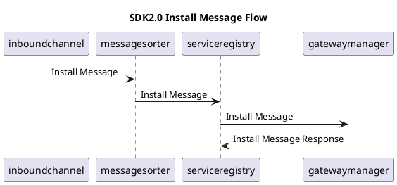
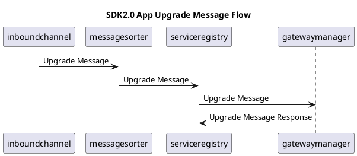
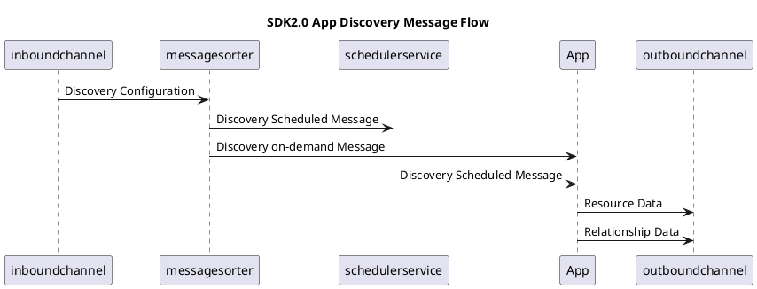
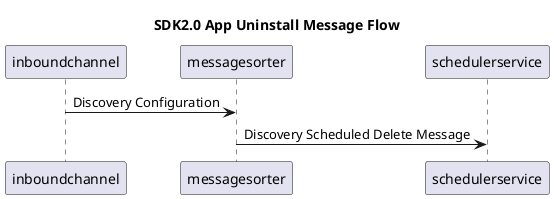
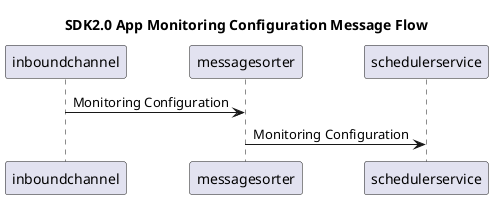
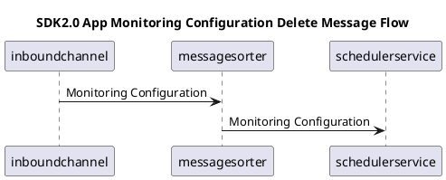
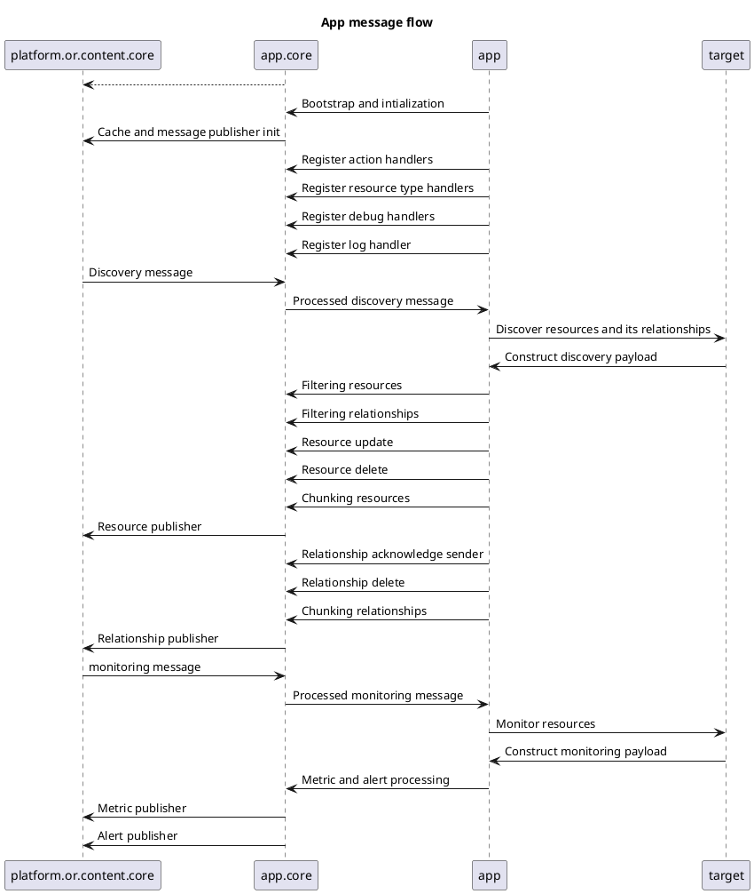

# SDK2.0 Messages

## App Install
<details><summary>App Installation </summary>

<details><summary>Sequence Diagram</summary>




</details>

<details><summary>Install Message[Json]</summary>

```json
{
  "messageId": "5a578452-bfd6-4614-8d79-bda3bb0adfa9",
  "messageVersion": "2.0.0",
  "appIntegrationId": "0bc95e12-ac99-427b-bf48-2235f198d970",
  "referenceId": "dc8abeaf-fd1f-44e0-b3ee-1142d277b040",
  "app": "AppController",
  "module": "App",
  "subtype": "Core",
  "action": "Install",
  "managementProfileId": "b4a64f28-e531-455e-b0ea-d5c853b4078a",
  "payload": {
    "app": "sample-sdk-app",
    "version": "1.0.0",
    "helm": {
      "pullType": "chart",
      "url": null,
      "credentials": {
        "username": null,
        "password": null,
        "token": null
      }
    },
    "maven": {
      "url": null
    }
  }
}

```
</details>

</details>

---

## App Upgrade

<details><summary>App Upgrade </summary>

<details><summary>Sequence Diagram</summary>


</details>

<details><summary>Upgrade Message[Json]</summary>

```json
{
  "messageId": "3cff7fd9-a629-4c25-954b-7cc7611ca6ab",
  "messageVersion": "2.0.0",
  "appIntegrationId": "0bc95e12-ac99-427b-bf48-2235f198d970",
  "referenceId": "cce5d149-d09e-42b8-9b0a-b4da951cce59",
  "app": "AppController",
  "module": "App",
  "subtype": "Core",
  "action": "Update",
  "managementProfileId": "b4a64f28-e531-455e-b0ea-d5c853b4078a",
  "payload": {
    "app": "sample-sdk-app",
    "version": "1.1.0",
    "helm": {
      "pullType": "chart",
      "url": null,
      "credentials": {
        "username": null,
        "password": null,
        "token": null
      }
    },
    "maven": {
      "url": null
    }
  }
}

```
</details>

</details>

---

## App Uninstall

<details><summary>App Uninstall </summary>

<details><summary>Sequence Diagram</summary>


</details>

<details><summary>Uninstall Message[Json]</summary>

```json
{
  "messageId": "b660d3ba-8f23-4f10-92ac-753fc5253e9e",
  "messageVersion": "2.0.0",
  "appIntegrationId": "0bc95e12-ac99-427b-bf48-2235f198d970",
  "referenceId": "2cc4cd9e-dde4-48e9-8936-77d553da1526",
  "app": "AppController",
  "module": "App",
  "subtype": "Core",
  "action": "Uninstall",
  "managementProfileId": "b4a64f28-e531-455e-b0ea-d5c853b4078a",
  "payload": {
    "app": "sample-sdk-app"
  }
}

```
</details>

</details>

---

## Discovery Configuration Update


<details><summary>Discovery Configuration </summary>

<details><summary>Sequence Diagram</summary>


</details>

<details><summary>Discovery Configuration [Json]</summary>

```json
{
  "messageId": "e92fbcce-91a1-4a90-97dd-f90be627cdc9",
  "messageVersion": "2.0.0",
  "appIntegrationId": "INTG-c7afb76c-a74e-4c40-bfab-3bffd5223a2f",
  "managementProfileId": "9d3f3eec-28f9-4696-9b8b-1d801692e036",
  "gateway": "9d3f3eec-28f9-4696-9b8b-1d801692e036",
  "module": "Discovery",
  "subtype": "Configuration",
  "app": "mock-vcenter-tested",
  "action": "Update",
  "configurationId": "ADAPTER-MANIFEST-65a5e123-65ad-41bc-8247-e8b12b11c09c",
  "configurationName": "vCenterTest1",
  "payload": {
    "data": {
      "port": "45000",
      "ipAddress": "172.25.252.193",
      "vcenterName": "vcenter1",
      "protocol": "http",
      "credentialId": [
        "6tAMNkXh5mSgVKUUVyNyTeWv"
      ]
    },
    "nativeTypes": {
      "vm": {
        "resourceType": "Server"
      },
      "host": {
        "resourceType": "Server"
      }
    }
  },
  "requireAck": false,
  "sha": "b87430a5051dec140907ead5a7a0c4bd0ef6a15e104d1300c0e00d58c3a720a6"
}

```
</details>

</details>

---

## Discovery Configuration Delete

<details><summary>Discovery Configuration Delete</summary>

<details><summary>Sequence Diagram</summary>


</details>

<details><summary>Discovery Configuration Delete[Json]</summary>

```json
{
  "messageId": "461e8c70-fae6-4178-a085-d4097d98b862",
  "messageVersion": "2.0.0",
  "appIntegrationId": "INTG-e195bc0d-1bd7-4392-b87a-86a2d5304a04",
  "managementProfileId": "9d3f3eec-28f9-4696-9b8b-1d801692e036",
  "gateway": "9d3f3eec-28f9-4696-9b8b-1d801692e036",
  "module": "Discovery",
  "subtype": "Configuration",
  "app": "mock-vcenter-tested",
  "action": "Delete",
  "configurationId": "ADAPTER-MANIFEST-3c53e214-49fd-4755-85fe-883e6d6a0bfe",
  "configurationName": "vCenterTest",
  "payload": {
    "data": {
      "port": "45000",
      "protocol": "http",
      "ipAddress": "172.25.252.193",
      "vcenterName": "vcenter1",
      "credentialId": [
        "6tAMNkXh5mSgVKUUVyNyTeWv"
      ]
    },
    "nativeTypes": {
      "vm": {
        "resourceType": "Server"
      },
      "host": {
        "resourceType": "Server"
      }
    }
  },
  "requireAck": false
}

```
</details>

</details>

---

## Monitoring Configuration Update


<details><summary>Monitoring Configuration Update</summary>

<details><summary>Sequence Diagram</summary>


</details>

<details><summary>Monitoring Configuration [Json]</summary>

```json
{
  "messageId": "73f8ad5a-2619-443e-9034-0b8b80f08ab1",
  "messageVersion": "2.0.0",
  "app": "mock-vcenter-tested",
  "module": "Monitoring",
  "subtype": "Configuration",
  "action": "Update",
  "payload": {
    "templateId": "2ff1793f-edbc-426d-ada1-1cd30af71c55",
    "nativeType": "host",
    "monitors": {
      "Performance Monitor mock-vcenter-tested host ": {
        "name": "Performance Monitor mock-vcenter-tested host ",
        "uuid": "1cec604c-3362-438a-8f8d-adcb9d23b400",
        "frequency": 5,
        "metrics": {
          "system_cpu_usage_utilization": {
            "availibityMetric": true,
            "units": "%",
            "graph": {
              "graphPoint": true
            },
            "notification": {
              "raiseAlert": true,
              "alertOn": "Static",
              "warn": {
                "operator": "GREATER_THAN",
                "value": "50",
                "repeat": 1
              },
              "critical": {
                "operator": "GREATER_THAN",
                "value": "70",
                "repeat": 1
              }
            },
            "formatPlottedValue": false
          }
        }
      }
    },
    "templateCustomization": {
      "customComponentThresholds": []
    }
  }
}

```
</details>

</details>

---

## Monitoring Configuration Delete


<details><summary>Monitoring Configuration Delete</summary>

<details><summary>Sequence Diagram</summary>


</details>

<details><summary>Monitoring Configuration [Json]</summary>

```json
```
</details>

</details>

---

# App Flow

<details><summary>App Flow</summary>

<details><summary>Sequence Diagram</summary>


</details>
</details>


